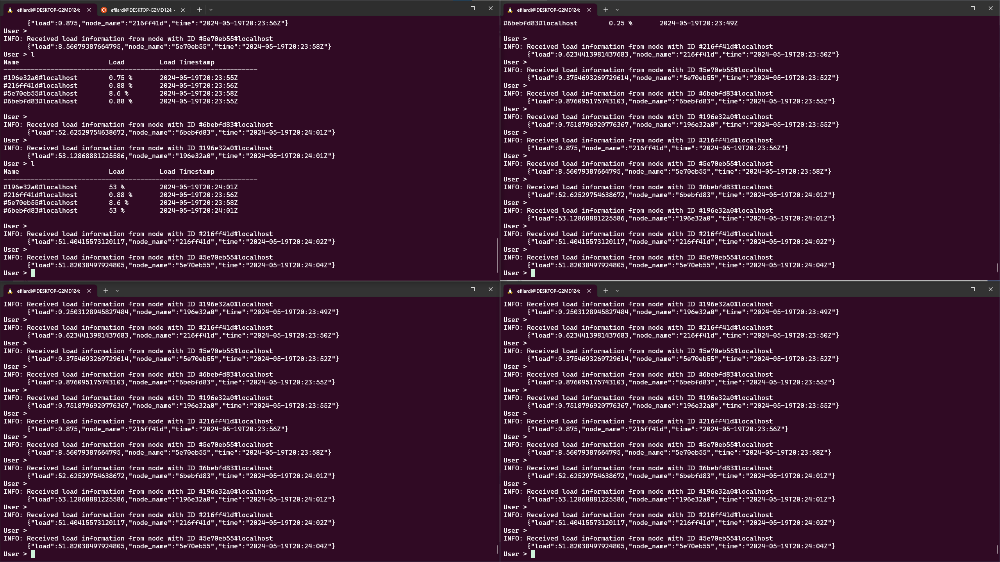

# Distributed Systems Load Monitor Assignment

Assignment for a course on Distributed Systems and Virtualization. This assignment involves implementing a distributed system cluster where nodes report their current processor load to other members. The implemention needs to use a Group Communication System (GCS). *Spread Toolkit* was used as GCS.

## How to Build Application

This application runs on Linux only and it is programmed in C++. For building the application *gcc*  >= 11.4.0 and *ninja-build* >= 1.10.1 are required. The application can be built either using Visual Studio 2022, targeting some WSL distribution or from the command line. For building on the command line the required instructions are:

`cmake -GNinja -B build`  
`ninja -C build`

## How to Run Application

The application can be run simply by executing on the command line:

`./DistributedSystemsLoadMonitorAssignment`

The *spread* daemon needs to be running in order for the application to work correctly. 

